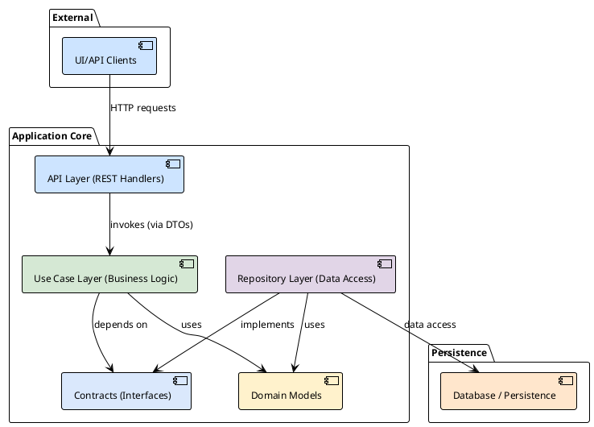

# Архитектура и Принципы Разработки

Этот документ описывает ключевые архитектурные решения, принципы и инструменты, используемые в проекте Warden. Он предназначен для быстрого введения в курс дела новых разработчиков и для синхронизации понимания внутри команды.

## 1. Философия: Чистая Архитектура

В основе проекта лежит **Слоистая Чистая Архитектура** (Layered Clean Architecture). Главная цель этого подхода — разделение ответственности (Separation of Concerns), что делает систему гибкой, тестируемой и легко поддерживаемой.

Ключевым правилом является **Правило Зависимостей (The Dependency Rule)**: зависимости в исходном коде могут быть направлены только *внутрь*. Ничто во внутреннем слое не может знать о внешнем.



## 2. Структура Проекта и Слои

### `internal/domain`
Это ядро нашего приложения. Здесь находятся доменные сущности (например, `User`, `Project`, `Issue`), которые не зависят ни от каких внешних фреймворков или баз данных. Они содержат только логику, специфичную для самой предметной области.

### `internal/contract`
Здесь объявлены **интерфейсы** (контракты), которые являются "мостами" между слоями. Например, Use Case'ы зависят от интерфейсов репозиториев, а не от их конкретных реализаций. Это основа принципа **Dependency Inversion (D)** из SOLID.

### `internal/usecases`
Слой бизнес-логики. Каждый use case инкапсулирует одно конкретное действие в системе (например, `users.Login`, `projects.Create`). Этот слой оркестрирует работу, используя доменные сущности и вызывая методы репозиториев и сервисов через их интерфейсы.

### `internal/repository`
Слой доступа к данным. Реализует интерфейсы из `internal/contract`. Его задача — преобразовывать доменные сущности в модели, специфичные для хранилища (БД), и выполнять операции чтения/записи.
- **Модели репозитория:** Внутри пакета репозитория объявляются свои структуры, соответствующие схеме таблиц.
- **Преобразование:** Каждая модель имеет метод `toDomain()`, который конвертирует её в доменную сущность. Это изолирует домен от деталей хранения данных.

### `internal/api/rest`
Внешний слой, отвечающий за взаимодействие с миром через REST API. Он содержит HTTP-хендлеры, которые принимают запросы, валидируют их, вызывают соответствующие use case'ы и форматируют ответ.

### `internal/services`
Вспомогательный слой для интеграции с внешними системами (email-рассыльщики, мессенджеры). Представляет собой клиенты-обертки, реализующие необходимые для use case'ов интерфейсы.

## 3. Процесс Разработки: API-First

Мы придерживаемся подхода **API-First**. Источником правды для нашего REST API является OpenAPI спецификация.

- **Спецификация:** `specs/server.yml`
- **Кодогенерация:** Для генерации HTTP-сервера, клиентов и DTO-структур используется `ogen`. Это гарантирует, что наша реализация всегда соответствует спецификации.
- **Команда:** `make generate-backend`

Преобразование сгенерированных `ogen` структур в доменные сущности и обратно происходит в `internal/dto`.

## 4. Менеджер Транзакций

Для обеспечения атомарности операций, затрагивающих несколько репозиториев, используется менеджер транзакций (`pkg/db/TxManager`). Use case'ы могут запускать операции в рамках одной транзакции, передавая транзакционный контекст в методы репозиториев. Репозитории же работают с более простым интерфейсом `pkg/db/Tx`.

## 5. Конфигурация

Приложение конфигурируется через переменные окружения. Структура конфигурации описана в `internal/config/config.go`.

## 6. Сборка и Запуск Приложения

Центральной точкой приложения является структура `App` в `internal/app.go`.

- **DI-контейнер:** Мы используем DI-контейнер ([github.com/rom8726/di](https://github.com/rom8726/di)) для автоматической инициализации и внедрения всех зависимостей (клиентов БД, репозиториев, use case'ов).
- **Запуск:** Метод `App.Run()` запускает все компоненты: HTTP-сервер, фоновые воркеры и т.д.

## 7. Функциональное Тестирование

Мы уделяем большое внимание автоматическому тестированию. Наша система функционального тестирования обеспечивает высокое покрытие и уверенность в качестве кода.

- **Изолированное окружение:** Тесты запускаются в полностью изолированном окружении, которое создается "на лету" с помощью **Testcontainers**. Для каждого тестового прогона поднимаются Docker-контейнеры с Postgres, Kafka, Redis и другими зависимостями.
- **Декларативные тест-кейсы:** Сами тесты описываются в YAML-файлах в директории `tests/cases`. Каждый файл представляет собой последовательность HTTP-запросов, проверок ответов и состояния БД.
- **Фикстуры:** Начальное состояние базы данных для тестов определяется в YAML-файлах в `tests/fixtures`.
- **Тестовый фреймворк:** Для запуска тестов используется внутренняя библиотека `testy`, которая парсит YAML-файлы, выполняет запросы к запущенному в тестовом режиме приложения и сравнивает результаты с ожидаемыми.
- **Запуск:** `go test -tags=integration ./tests/...`

Этот подход позволяет нам писать сложные E2E-сценарии без написания большого количества boilerplate-кода на Go.

## 8. Мокирование и Юнит-тесты

Для юнит-тестирования зависимостей (например, репозиториев в use case'ах) мы используем моки.

- **Инструмент:** `mockery`
- **Конфигурация:** `.mockery.yaml`
- **Команда:** `make mocks`
- **Расположение:** Сгенерированные моки хранятся в `test_mocks/`.

## 9. Линтинг и Форматирование Кода

Мы используем строгие правила линтинга для обеспечения качества и единообразия кода.

- **Линтер:** `golangci-lint` с конфигурацией в `.golangci.yml`
- **Длина строки:** Максимум **120 символов** для всего кода (включая тесты)
- **Форматирование:** Автоматическое форматирование с помощью `gofmt` и `gofumpt`

### Правила форматирования длинных строк

При превышении лимита в 120 символов:

**Функции:**
```go
// ❌ Неправильно - слишком длинная строка
func CreateUserWithDetailedProfile(ctx context.Context, username string, email string, firstName string, lastName string, role string, teamID int, isActive bool) (*User, error) {

// ✅ Правильно - параметры в столбик
func CreateUserWithDetailedProfile(
    ctx context.Context,
    username string,
    email string,
    firstName string,
    lastName string,
    role string,
    teamID int,
    isActive bool,
) (*User, error) {
```

**Структуры:**
```go
// ❌ Неправильно
type UserRepository interface {
    CreateUser(ctx context.Context, username string, email string, firstName string, lastName string, role string, teamID int, isActive bool) (*User, error)
}

// ✅ Правильно
type UserRepository interface {
    CreateUser(
        ctx context.Context,
        username string,
        email string,
        firstName string,
        lastName string,
        role string,
        teamID int,
        isActive bool,
    ) (*User, error)
}
```

**Вызовы функций:**
```go
// ❌ Неправильно
result, err := userService.CreateUserWithDetailedProfile(ctx, username, email, firstName, lastName, role, teamID, isActive)

// ✅ Правильно
result, err := userService.CreateUserWithDetailedProfile(
    ctx,
    username,
    email,
    firstName,
    lastName,
    role,
    teamID,
    isActive,
)
```

## 10. Docker-готовность

Проект полностью готов к развертыванию в Docker-окружении.

### Разработка с Docker Compose

- **Конфигурация:** `dev/docker-compose.yml` - полный набор сервисов для разработки
- **Управление:** `dev/dev.mk` - команды для управления окружением
- **Переменные окружения:** `dev/config.env.example` - шаблон конфигурации

### Основные команды разработки

```bash
# Поднять окружение
make dev-up

# Остановить окружение
make dev-down

# Полная очистка (удаление контейнеров, образов, томов)
make dev-clean

# Просмотр логов
make dev-logs

# Запуск
make dev-run
```

### Продакшн Dockerfile

- **Многоэтапная сборка:** Используется `golang:1.24-alpine` для сборки и `scratch` для финального образа
- **Минимальный размер:** Финальный образ содержит только исполняемый файл и миграции
- **Безопасность:** Отсутствие shell и базовых утилит в продакшн образе

## 11. Рекомендации для ИИ-ассистентов

При генерации кода для этого проекта строго следуйте следующим принципам:

### Архитектурные принципы

1. **Слоистая архитектура:** Никогда не нарушайте границы между слоями
    - API-слой может вызывать только use case'ы
    - Use case'ы могут вызывать только интерфейсы из `internal/contract`
    - Репозитории реализуют интерфейсы из `internal/contract`

2. **Dependency Inversion:** Все зависимости должны идти через интерфейсы
   ```go
   // ✅ Правильно
   type UserService struct {
       userRepo contract.UserRepository
       emailService contract.EmailService
   }
   
   // ❌ Неправильно
   type UserService struct {
       userRepo *repository.UserRepository
   }
   ```

3. **Доменная модель:** Доменные сущности не должны зависеть от внешних фреймворков
   ```go
   // ✅ Правильно - доменная сущность
   type User struct {
       ID       int
       Username string
       Email    string
   }
   
   // ❌ Неправильно - модель репозитория
   type UserModel struct {
       ID       int    `db:"id"`
       Username string `db:"username"`
       Email    string `db:"email"`
   }
   ```

### Стиль кода

1. **Длина строки:** Строго соблюдайте лимит в 120 символов
2. **Именование:** Используйте camelCase для переменных и функций, PascalCase для экспортируемых типов
3. **Обработка ошибок:** Всегда проверяйте ошибки, не игнорируйте их
4. **Контекст:** Передавайте `context.Context` в качестве первого параметра в методах, которые могут быть отменены

### Тестирование

1. **Юнит-тесты:** Пишите тесты для use case'ов с использованием моков
2. **Интеграционные тесты:** Создавайте YAML-файлы в `tests/cases/` для E2E-сценариев
3. **Фикстуры:** Определяйте тестовые данные в `tests/fixtures/`

### API и DTO

1. **OpenAPI-first:** Все изменения API должны начинаться с обновления `specs/server.yml`
2. **DTO-преобразования:** Используйте `internal/dto` для конвертации между API и доменными структурами
3. **Валидация:** Валидируйте входные данные на уровне API-хендлеров

### Примеры правильного кода

**Use Case:**
```go
func (s *UserService) CreateUser(
    ctx context.Context,
    username string,
    email string,
) (*domain.User, error) {
    user := &domain.User{
        Username: username,
        Email:    email,
    }
    
    if err := s.userRepo.Create(ctx, user); err != nil {
        return nil, fmt.Errorf("create user: %w", err)
    }
    
    return user, nil
}
```

**Repository:**
```go
func (r *UserRepository) Create(
    ctx context.Context,
    user *domain.User,
) error {
    model := &UserModel{
        Username: user.Username,
        Email:    user.Email,
    }
    
    if err := r.db.WithContext(ctx).Create(model).Error; err != nil {
        return fmt.Errorf("insert user: %w", err)
    }
    
    user.ID = model.ID
    return nil
}
```

**API Handler:**
```go
func (h *UserHandler) CreateUser(w http.ResponseWriter, r *http.Request) {
    var req dto.CreateUserRequest
    if err := json.NewDecoder(r.Body).Decode(&req); err != nil {
        http.Error(w, "invalid request", http.StatusBadRequest)
        return
    }
    
    user, err := h.userService.CreateUser(r.Context(), req.Username, req.Email)
    if err != nil {
        http.Error(w, err.Error(), http.StatusInternalServerError)
        return
    }
    
    response := dto.UserFromDomain(user)
    json.NewEncoder(w).Encode(response)
}
```

Следуя этим принципам, вы будете создавать код, который соответствует архитектуре проекта и легко интегрируется в существующую кодовую базу.
